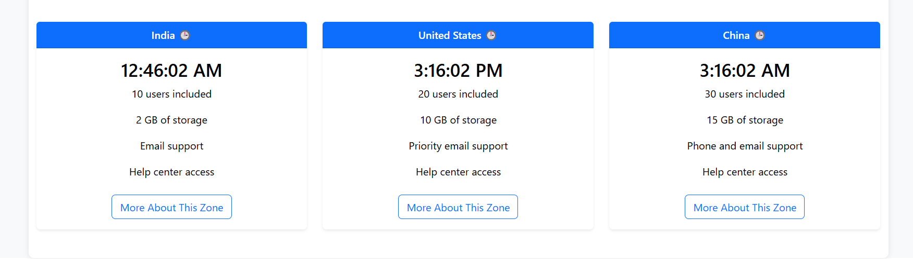
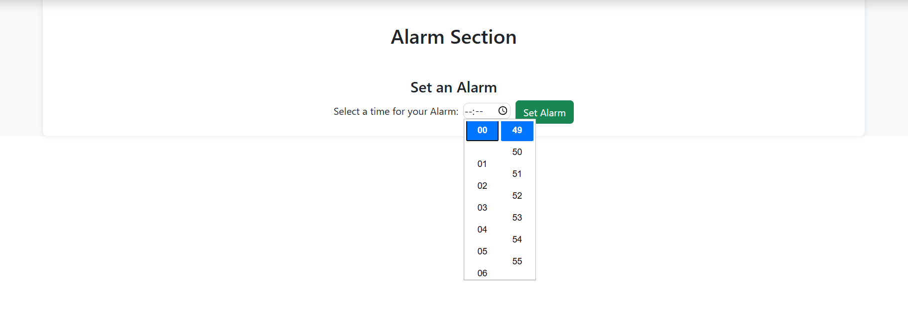

# 🌍 World Clock React App

An interactive and dynamic world clock web app built with React, Leaflet, and Bootstrap. Easily explore global time zones, set alarms, and add custom clocks by clicking anywhere on a world map!

---

## ✨ Features

- 🕐 Real-time clocks for India, USA, China (and more!)
- 🗺️ Interactive **world map** – click on any country to add its clock
- ⏰ Set and manage **alarms**
- ➕ Add clocks of custom time zones
- 🌓 Light/Dark mode toggle
- 💅 Fully responsive Bootstrap UI

---

## 🌍 Preview

### 🕒 Clock Cards


### 🗺 Click on Map to Add Clock


### ⏰ Alarm Section



## 🚀 Getting Started

```bash
git clone https://github.com/510kirti/World_Clock.git
cd World_Clock
npm install
npm start
